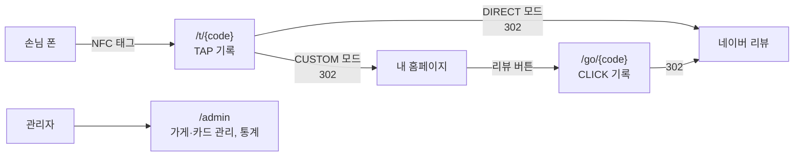

# NFC 리뷰 카드 서버

매장 테이블의 NFC 카드를 태그한 손님을 네이버 리뷰로 연결하고, 태그와 리뷰 버튼 클릭을 기록해 카드(테이블)별·날짜별 통계를 보여주는 서비스입니다. 실제 매장(빨간주막)에 배포해 운영하는 것을 목표로 만들었습니다.

## 동작 흐름



## 기술 스택

- Java 21, Spring Boot 4.1 (Spring MVC, Thymeleaf, Spring Security)
- Spring Data JPA (Hibernate 7), Flyway, MySQL 8
- Docker, Docker Compose, Caddy(자동 HTTPS), GitHub Actions, AWS EC2

## 핵심 설계 결정

- **기록 실패가 손님을 막지 않는다**: 이벤트 저장을 별도 트랜잭션(별도 빈)으로 분리하고 예외를 격리해, 저장이 실패해도 리다이렉트는 항상 성공합니다.
- **DB 장애 시 마지막으로 성공한 조회 결과로 대체**: 카드별 최근 조회 결과를 불변 스냅샷(record)으로 메모리에 보관하고, 커넥션 타임아웃을 3초로 줄여 장애 중에도 손님이 오래 기다리지 않게 했습니다. 장애 중에는 기록 시도를 생략합니다.
- **리다이렉트 주소 안전 처리**: 관리자가 입력한 리뷰 주소에 한글이 있으면 Tomcat이 Location 헤더를 제거해 손님이 빈 화면에 멈추고(CLICK은 기록돼 통계로는 드러나지 않음), `{`가 있으면 URI 템플릿으로 해석되어 500이 납니다. 리다이렉트 직전에 RFC 3986 밖의 문자만 퍼센트 인코딩해 해결했습니다(기존 `%XX`는 유지).
- **DIRECT / CUSTOM 두 가지 랜딩 모드**: DIRECT는 NFC 탭 즉시 네이버 리뷰로 이동(TAP+CLICK 동시 기록), CUSTOM은 가게가 직접 만든 정적 페이지를 거쳐 리뷰로 이동(TAP 후 CLICK 별도 기록)합니다.
- **UTC 저장, 한국 날짜 집계**: `Instant`/`TIMESTAMP(6)`로 저장하고 `CONVERT_TZ`로 집계해 서버 시간대와 무관하게 정확한 일별 통계를 냅니다. 집계는 DB의 `GROUP BY`/`CASE WHEN`으로 처리하고 빈 날짜는 애플리케이션에서 채웁니다.
- **스키마는 Flyway, Hibernate는 validate만**: 모든 DB 변경이 버전 관리되고, 엔티티와 스키마가 어긋나면 애플리케이션이 시작되지 않습니다.
- **추측 불가능한 카드 코드**: `SecureRandom` 기반 8자리 코드(혼동 문자 제외)로 카드 주소 추측과 통계 조작을 막습니다.
- **봇 방문 제외**: 카카오톡 링크 미리보기, 네이버 Yeti 같은 크롤러는 User-Agent로 걸러 집계에서 뺍니다. 네이버·카카오톡 인앱 브라우저로 들어온 실제 손님이 걸러지지 않도록 테스트로 고정했습니다.
- **운영 설정은 기본값 없이**: `prod` 프로필은 환경변수를 `${VAR:}`(없으면 빈 값)로 받고 `@Validated`로 검증해 필수 값이 빠지면 시작하지 않습니다. `${VAR}`로 두면 스프링이 해석하지 못한 자리표시자를 문자열 그대로 바인딩해, 관리자 비밀번호가 `${ADMIN_PASSWORD}`인 채로 기동되는 문제를 확인하고 고쳤습니다.
- **테스트를 통과해야만 배포**: GitHub Actions에서 MySQL 서비스 컨테이너로 통합 테스트를 돌린 뒤 이미지를 커밋 SHA로 태깅해 배포하고, SHA 태그로 즉시 롤백할 수 있습니다.

## 로컬 실행

```bash
docker compose up --build
```

→ http://localhost:8080/admin (기본 계정: `admin` / `admin1234`)

환경변수로 직접 실행하려면:

```bash
DB_URL=jdbc:mysql://localhost:3307/nfcreview?serverTimezone=UTC \
DB_USERNAME=nfcreview DB_PASSWORD=localpass \
./gradlew bootRun
```

## 배포 구조

`deploy/compose.yaml`: Caddy(HTTPS, 리버스 프록시) → Spring Boot 앱 → MySQL. 앱과 DB 포트는 외부에 노출하지 않고, 비밀값은 서버의 `.env`로만 주입합니다. 로그는 크기 제한으로 회전하고, DB는 매일 백업합니다.

## 문서

`docs/` 폴더에 이 프로젝트를 처음부터 만드는 과정을 11개 파트로 정리했습니다. `docs/00-start.md`부터 보세요.
